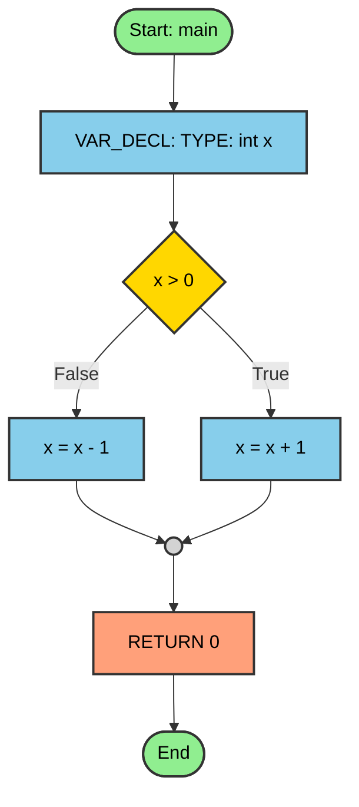

# Design da Estrutura e Algoritmo para Geração de Fluxograma Mermaid (CFG)

## 1. Introdução ao Grafo de Fluxo de Controle (CFG) com Mermaid

O Grafo de Fluxo de Controle (CFG) é uma representação visual do fluxo de execução de um programa. No CtoMMD, implementamos a geração de CFGs usando a sintaxe Mermaid, que oferece uma visualização moderna e interativa dos fluxogramas.

O objetivo principal é converter código C em fluxogramas visuais que sejam:
- **Intuitivos**: Fáceis de entender para iniciantes em programação
- **Detalhados**: Mostram todas as estruturas de controle (if-else, loops, funções)
- **Compatíveis**: Funcionam com visualizadores online, editores e Mermaid CLI
- **Estilizados**: Usam cores e formas específicas para cada tipo de elemento

## 2. Arquitetura da Geração Mermaid

### 2.1. Fluxo de Processamento

```
Código C → AST → CFG → Arquivo .mmd → Visualização
```

1. **Parsing**: O código C é analisado e convertido em AST
2. **Construção do CFG**: A AST é percorrida recursivamente para construir o CFG
3. **Geração Mermaid**: O CFG é convertido para sintaxe Mermaid
4. **Visualização**: O arquivo .mmd pode ser visualizado ou convertido para imagem

### 2.2. Tipos de Nós CFG

O enum `CFGNodeType` define os tipos de nós suportados:

```c
typedef enum {
    CFG_NODE_ENTRY,        // Início de função
    CFG_NODE_EXIT,         // Fim de função
    CFG_NODE_STATEMENT,    // Instruções gerais
    CFG_NODE_CONDITION,    // Condições (if, while, for)
    CFG_NODE_JOIN,         // Convergência de fluxos
    CFG_NODE_FUNCTION_CALL,// Chamadas de função
    CFG_NODE_RETURN        // Instruções return
} CFGNodeType;
```

### 2.3. Estruturas de Dados

#### CFGNode
```c
typedef struct CFGNode {
    int id;                    // ID único do nó
    CFGNodeType type;          // Tipo do nó
    char *label;               // Texto do nó
    CFGEdge *edges;            // Lista de arestas de saída
    AST *ast_node_ref;         // Referência ao nó AST original
    struct CFGNode *list_next; // Lista global de nós
    int visited;               // Flag para travessias
} CFGNode;
```

#### CFGEdge
```c
typedef struct CFGEdge {
    CFGNode *to;          // Nó de destino
    char *label;          // Rótulo da aresta ("True", "False", etc.)
    struct CFGEdge *next; // Próxima aresta
} CFGEdge;
```

#### CFGFragment
```c
typedef struct {
    CFGNode *entry;  // Ponto de entrada
    CFGNode *exit;   // Ponto de saída
} CFGFragment;
```

## 3. Algoritmo de Construção do CFG

### 3.1. Função Principal: `build_cfg_from_ast_recursive`

Esta função percorre a AST recursivamente e constrói fragmentos CFG:

```c
CFGFragment build_cfg_from_ast_recursive(AST *node, CFGNode *entry_node, CFGNode *exit_node)
```

### 3.2. Processamento por Tipo de Nó AST

#### Declaração de Função (`AST_FUNC_DECL`)
- Cria nós de início e fim da função
- Processa o corpo da função recursivamente
- Conecta início → corpo → fim

#### Declarações e Atribuições (`AST_VAR_DECL`, `AST_ASSIGN`)
- Cria nó de instrução com rótulo descritivo
- Processa nós irmãos (sequência de instruções)
- Conecta instruções em sequência

#### Condicionais (`AST_IF`)
- Cria nó de condição (formato losango)
- Processa branch True e False separadamente
- Cria nó de junção para convergência
- Conecta: condição → branches → junção

#### Loops (`AST_WHILE`, `AST_FOR`)
- Cria nó de condição do loop
- Processa corpo do loop
- Conecta: condição → corpo → volta para condição
- Saída False da condição vai para após o loop

#### Retorno (`AST_RETURN`)
- Cria nó de retorno específico
- Processa nós irmãos se existirem

### 3.3. Processamento de Nós Irmãos

Uma característica importante é o processamento de nós irmãos (`node->prox`):
- Cada tipo de nó verifica se há nós irmãos
- Conecta o nó atual ao próximo nó irmão
- Garante que todas as instruções sejam incluídas no fluxograma

## 4. Geração da Sintaxe Mermaid

### 4.1. Função `cfg_to_mermaid`

A geração do arquivo Mermaid é feita em três passadas:

#### Primeira Passada: Definição dos Nós


#### Segunda Passada: Definição das Arestas
```mermaid
    0 --> 2
    2 --> 3
    3 -->|True| 5
    3 -->|False| 6
```

#### Terceira Passada: Aplicação de Estilos
```mermaid
    class 0 startEnd
    class 2 process
    class 3 decision
```

### 4.2. Formas e Cores dos Nós

| Tipo | Forma Mermaid | Cor | Uso |
|------|---------------|-----|-----|
| Entry/Exit | `([texto])` | Verde | Início/fim de função |
| Condition | `{texto}` | Amarelo | Decisões (if, while) |
| Statement | `[texto]` | Azul claro | Instruções gerais |
| Function Call | `[[texto]]` | Roxo | Chamadas de função |
| Return | `[texto]` | Laranja | Instruções return |
| Join | `(( ))` | Cinza | Convergência de fluxos |

### 4.3. Compatibilidade com Mermaid CLI

Para garantir compatibilidade com o Mermaid CLI, implementamos:

1. **Separação de estilos**: Não usamos `:::` inline
2. **Sintaxe `class`**: Aplicamos estilos usando `class nodeId className`
3. **Escape de caracteres**: Tratamos caracteres especiais adequadamente
4. **Operadores corretos**: Mantemos `<` e `>` nas condições

## 5. Integração com Makefile

### 5.1. Novas Opções Implementadas

#### `make compPng ARQUIVO=entrada.c`
- Compila o código C
- Gera o arquivo cfg.mmd
- Converte para PNG usando Mermaid CLI
- Verifica se o Mermaid CLI está instalado

#### `make compPdf ARQUIVO=entrada.c`
- Mesmo processo, mas gera PDF
- Útil para documentação e relatórios

#### `make cleanImg`
- Remove arquivos de imagem gerados (PNG, PDF, SVG)
- Remove arquivo cfg.mmd

#### `make cleanAll`
- Combina `clean` e `cleanImg`
- Limpeza completa do projeto

### 5.2. Verificações de Segurança

O Makefile inclui verificações para:
- Existência do arquivo de entrada
- Instalação do Mermaid CLI
- Geração bem-sucedida do arquivo cfg.mmd
- Mensagens de erro claras e instruções de correção

## 6. Exemplo de Fluxograma Gerado

### Código C de Entrada:
```c
int main(){
   int x;
   if (x > 0) {
       x = x + 1;
   } else {
       x = x - 1;
   }
   return 0;
}
```

### Arquivo cfg.mmd Gerado:


## 7. Vantagens da Implementação Mermaid

### 7.1. Compatibilidade Universal
- **Visualizadores online**: Mermaid Live Editor, GitHub, GitLab
- **Editores**: VS Code, Obsidian, Notion
- **CLI**: Conversão para PNG, PDF, SVG
- **Documentação**: Integração com Markdown

### 7.2. Facilidade de Uso
- Sintaxe textual legível
- Não requer software adicional para visualização básica
- Suporte nativo em muitas plataformas

### 7.3. Flexibilidade
- Fácil customização de cores e estilos
- Suporte a diferentes layouts
- Extensibilidade para novos tipos de nós

## 8. Melhorias Futuras

### 8.1. Estruturas Avançadas
- Suporte completo a `switch-case`
- Tratamento de `goto`
- Loops `do-while` mais detalhados

### 8.2. Otimizações
- Simplificação de nós redundantes
- Agrupamento de instruções sequenciais
- Detecção de código inalcançável

### 8.3. Interatividade
- Links para código fonte
- Tooltips com informações adicionais
- Navegação entre funções

## 9. Conclusão

A implementação do CFG com Mermaid no CtoMMD oferece uma solução moderna e versátil para visualização de fluxogramas de código C. A arquitetura modular permite fácil manutenção e extensão, enquanto a compatibilidade com múltiplas ferramentas garante ampla usabilidade.

A separação clara entre construção do CFG e geração da sintaxe Mermaid facilita futuras melhorias e adaptações para outros formatos de visualização.

